# p-limit + cli-progress

A simple example of usage of p-limit & cli-progress with deno :

```typescript
import { plimitp } from "https://deno.land/x/p_limit_cli_progress@0.1.0/p_limit_progress_bar.ts";

const sleep = (ms) => new Promise((resolve) => setTimeout(resolve, ms));
const data = [...Array(100).keys()]
  .map((i) => ({ title: `data ${i}`, value: Math.random() }));

const limitp = plimitp(10);
data.map(({ value, title }) => limitp(() => sleep(100 + value * 1000), title));
```

Another example with several bar :



```typescript
// example_multibar.ts
import {
  createMultibar,
  PlimitProgressBar,
} from "https://deno.land/x/p_limit_cli_progress@0.1.0/p_limit_progress_bar.ts";

const generateTestData = () =>
  [...Array(30).keys()]
    .map((i) => ({ title: `data ${i}`, value: Math.random() }));

const data1 = generateTestData();
const data2 = generateTestData();
const data3 = generateTestData();

const sleep = (ms: number) => new Promise((resolve) => setTimeout(resolve, ms));

const multiBar = createMultibar();
const bar1 = new PlimitProgressBar(6, "test 1", multiBar);
const bar2 = new PlimitProgressBar(8, "test 2", multiBar);
const bar3 = new PlimitProgressBar(5, "test 3", multiBar);

data1.map(({ value, title }) => bar1.limitp(() => sleep(value * 1000), title));
data2.map(({ value, title }) => bar2.limitp(() => sleep(value * 1000), title));
data3.map(({ value, title }) => bar3.limitp(() => sleep(value * 1000), title));
```
